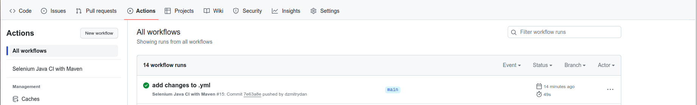
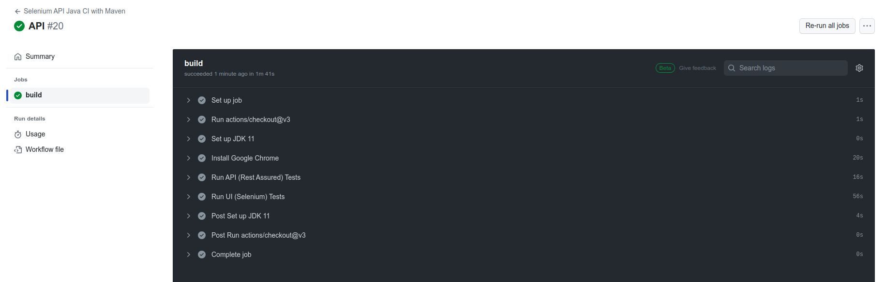

# Selenium and GitHub Actions
## Description
- Selenium
- Rest Assured
- Java
- Maven
- TestNG

#### Test launch options (Selenium tests):
- Browser:
  - Google Chrome
  - Firefox
- Browser mode
  - Headless
  - Not headless

#### Using GitHub Actions for CI/CD
- file: .github/workflows/**maven.yml**




#### Run tests
Run UI tests:
```
mvn clean test -Dbrowsermode.headless=true -Dsurefire.suiteXmlFiles=src/test/resources/suites/uiTests.xml
```
Run UI tests:
```
mvn clean test -Dbrowsermode.headless=false -Dsurefire.suiteXmlFiles=src/test/resources/suites/simpleTest.xml
```
Run API tests:
```
mvn clean test -Dsurefire.suiteXmlFiles=src/test/resources/suites/apiTests.xml
```
